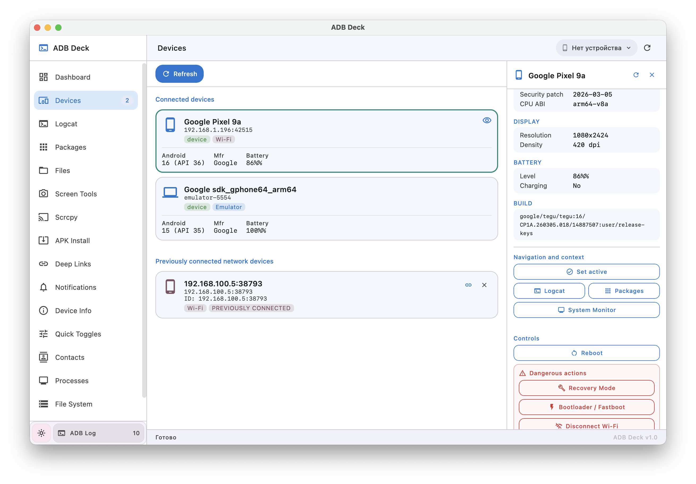
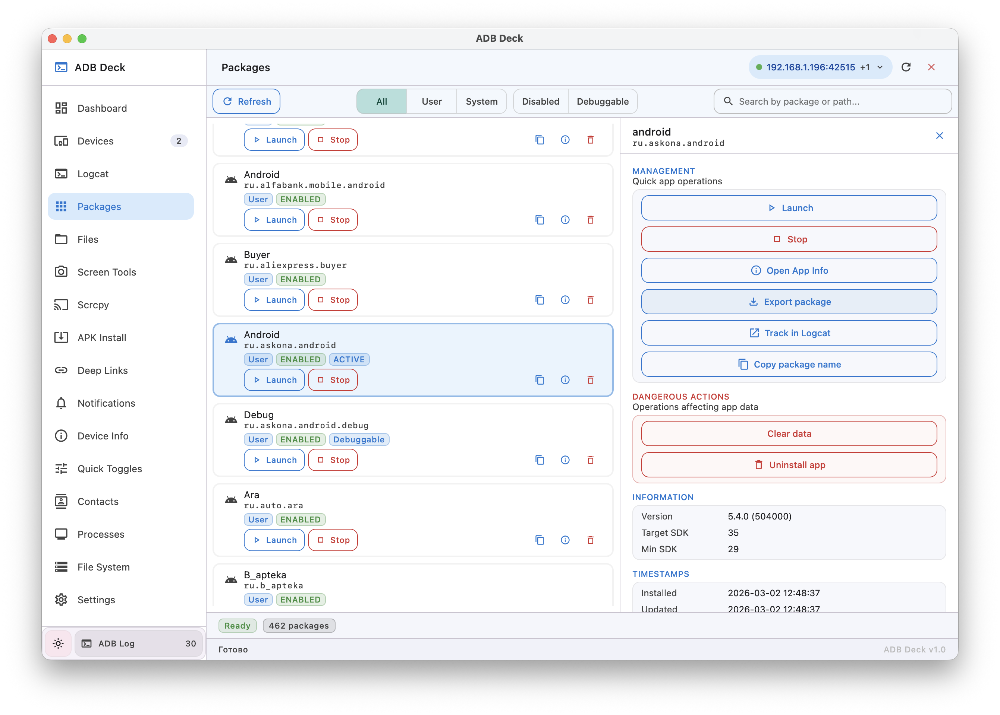
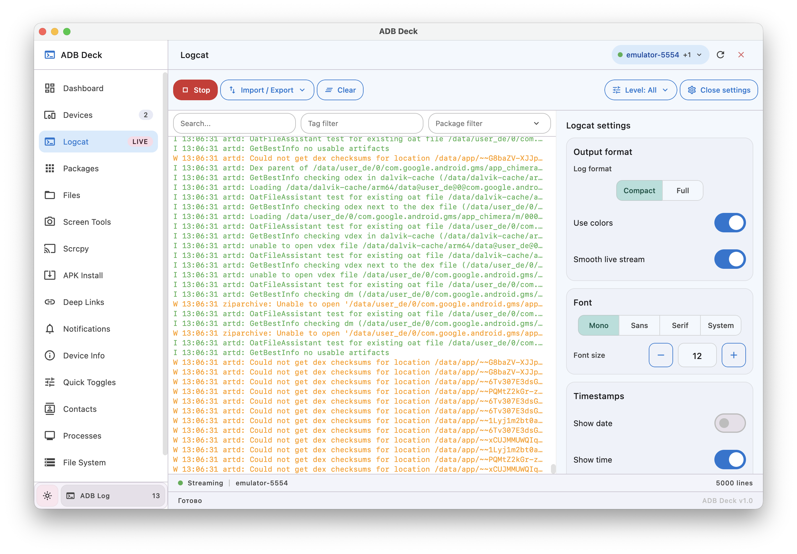
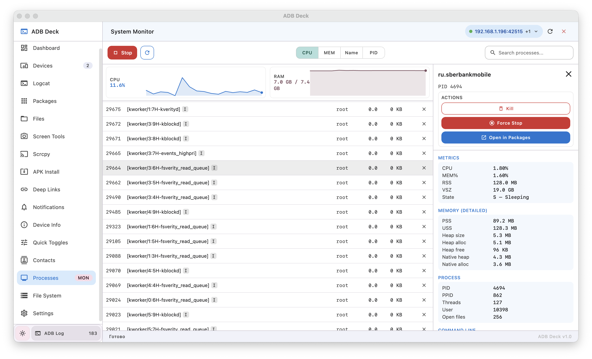
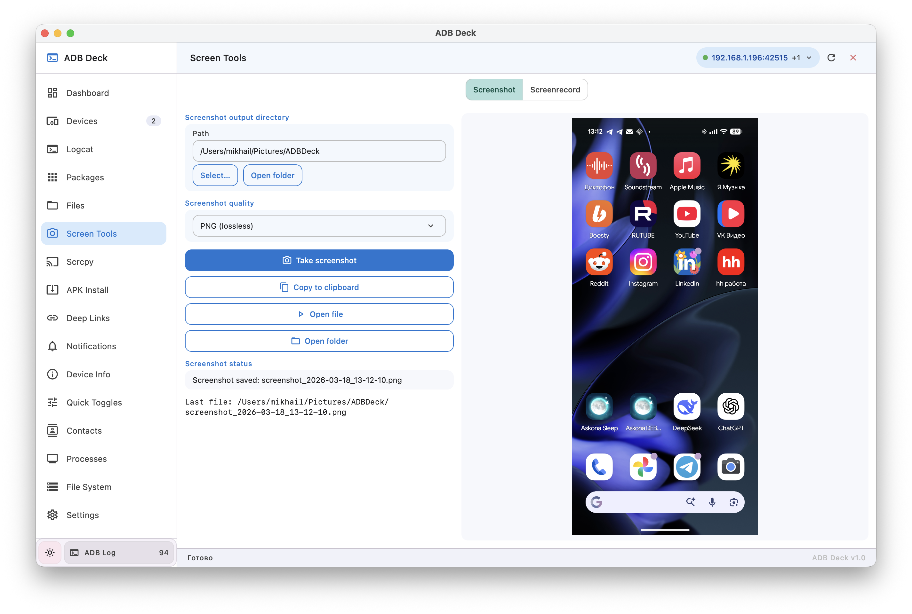
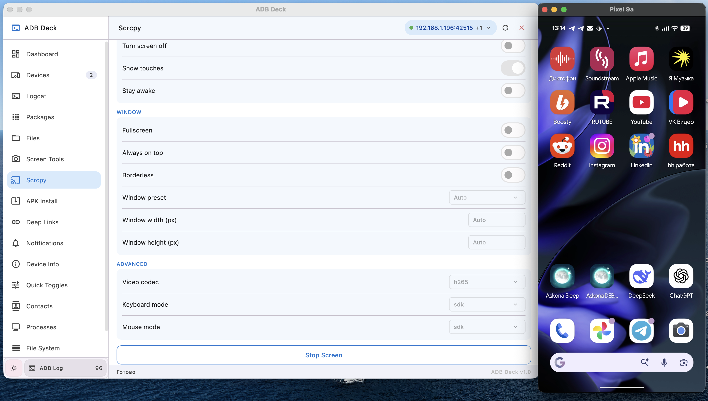
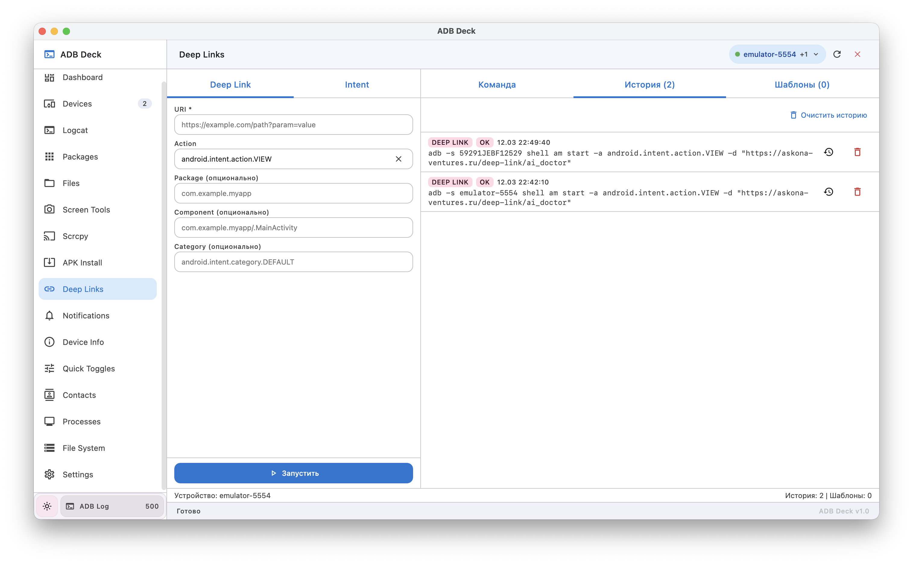
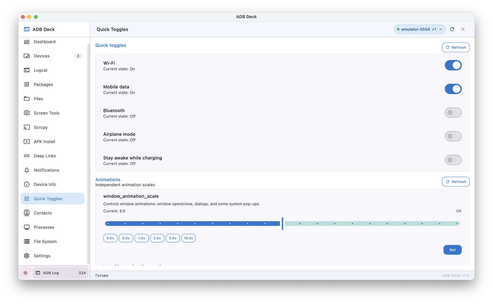

# ADB Deck

🇬🇧 English | 🇷🇺 [Русская версия](./docs/README_RU.md)

---

ADB Deck is a desktop GUI for working with Android devices over ADB.
A clean interface on top of raw `adb` commands — no need to memorize shell incantations or juggle terminal tabs.

Built for **Android developers**, **QA engineers**, and anyone who finds themselves typing `adb shell` more often than they'd like.

---

## 🚀 Features

### 📱 Device Manager
Connect and switch between multiple devices simultaneously — USB and Wi-Fi. Remembers previously connected network devices for quick reconnect.

### 📋 Logcat
Live log streaming with tag, package, and level filters. Color-coded output, compact and full format modes, smooth live scroll. Import and export log sessions.

### 📦 Package Manager
Browse all installed packages with User / System / Disabled / Debuggable filters. Per-app actions: launch, stop, open system info, export APK, clear data, uninstall. Detailed view with version, target SDK, min SDK, install and update timestamps. Jump to Logcat filtered by package in one click.

### 📂 File Explorer
Dual-pane view — local filesystem on the left, device filesystem on the right. Push files to the device, pull files from it. Create folders, rename, delete.

### 🖥️ Screen Tools
Take screenshots with configurable output path and format (PNG/JPEG). Preview immediately, copy to clipboard or open folder. Screen recording support.

### 🪞 Screen Mirror (Scrcpy)
Launch scrcpy directly from the app with a settings panel: fullscreen, borderless, always on top, window size, video codec, keyboard and mouse mode.

### 📲 APK Install
Drag-and-drop or browse to install APKs onto the connected device.

### 🔗 Deep Links & Intents
Fire deep links and custom intents without touching the terminal. Specify action, package, component, and category. Switch between Deep Link, Intent, and raw shell command modes. History and reusable templates included.

### 🔔 Notifications Inspector & Composer
Live notification feed with history and saved snapshots. Full detail view: package, channel, importance, flags, actions, visual parameters, raw dump. Built-in notification composer to test your own notifications.

### ℹ️ Device Info
Comprehensive device information across 13 sections: Overview, Build, Display, CPU / RAM, Battery, Network, Cellular, Modem, IMS/RCS, Storage, Security, System. Export everything as JSON.

### ⚡ Quick Toggles
Toggle Wi-Fi, Mobile data, Bluetooth, Airplane mode, and Stay awake directly from the UI. Fine-tune animation scales (window, transition, animator) with a slider — useful for disabling animations during UI testing.

### 📊 System Monitor
Real-time process list with live CPU and memory graphs. Per-process details: RSS, heap, VSZ, threads, file descriptors, state. Kill or force-stop a process, or jump straight to its entry in the Package Manager.

### 👤 Contacts
Browse device contacts.

### 📁 File System
Explore the raw device filesystem tree.

### 🪵 ADB Log
Every ADB command the app sends is logged in the built-in log panel — great for learning, auditing, or debugging unexpected behavior.

---

## 🖥️ Screenshots

<table>
  <tr>
    <td></td>
    <td></td>
  </tr>
  <tr>
    <td align="center"><em>Device Manager — USB & Wi-Fi</em></td>
    <td align="center"><em>Package Manager</em></td>
  </tr>
  <tr>
    <td></td>
    <td></td>
  </tr>
  <tr>
    <td align="center"><em>Logcat — live streaming with filters</em></td>
    <td align="center"><em>System Monitor — processes & CPU</em></td>
  </tr>
  <tr>
    <td></td>
    <td></td>
  </tr>
  <tr>
    <td align="center"><em>Screen Tools — screenshot with preview</em></td>
    <td align="center"><em>Screen Mirror via Scrcpy</em></td>
  </tr>
  <tr>
    <td></td>
    <td></td>
  </tr>
  <tr>
    <td align="center"><em>Deep Links & Intent Launcher</em></td>
    <td align="center"><em>Quick Toggles & Animation Scales</em></td>
  </tr>
</table>

---

## ⚙️ Installation

1. Download the latest `.dmg` / `.deb` / `.msi` from [Releases](../../releases)
2. Launch **ADB Deck**
3. Open **Settings**
4. Point it at your `adb` binary (from [Android Platform Tools](https://developer.android.com/tools/releases/platform-tools))
5. Click **Check**

That's it. No terminal required after this point.

---

## 🔧 Requirements

- **ADB** — [Android Platform Tools](https://developer.android.com/tools/releases/platform-tools)
- Android device with **USB debugging** enabled (Developer Options)
- For Wi-Fi debugging: Android 11+ (wireless debugging) or `adb tcpip` setup on Android 10 and below
- **Scrcpy** — only required if you want screen mirroring (install separately)

**Supported platforms:**
- macOS
- Linux
- Windows

---

## 🏗️ Architecture

| Layer | Technology |
|---|---|
| UI | Kotlin + Compose Multiplatform (Desktop) |
| Navigation | Decompose (child stack, component lifecycle) |
| DI | Koin |
| Async | Coroutines + StateFlow |
| Settings persistence | Kotlinx Serialization → `~/.adbdeck/settings.json` |

**Module structure:**

```
:app                  — entry point, DI, root navigation
:core:process         — ProcessRunner (wraps adb subprocess)
:core:adb-api         — interfaces and domain models
:core:adb-impl        — ADB command execution and output parsing
:core:settings        — app settings (adb path, theme)
:core:designsystem    — colors, typography, dimensions
:core:ui              — shared composables (loading, error, banners)
:core:utils           — extensions
:feature:*            — one module per screen, fully isolated
```

Each feature module owns its own state, component interface, default implementation, and UI. Features don't depend on each other — cross-feature navigation goes through the root component via callbacks.

---

## 🗺️ Roadmap

- [ ] Port forwarding UI
- [ ] Network traffic inspector
- [ ] Plugin / extension system
- [ ] Terminal emulator panel

---

## ⚠️ Disclaimer

ADB is a powerful tool. It can clear app data, uninstall system packages, kill processes, and do other things you might not be able to undo.

This app does not add training wheels.
If you're not sure what a button does — maybe don't press it.

---

## 🤝 Contributing

Join us in shaping the future of this project — your contributions are invaluable!
Feel free to open an issue or submit a pull request for any bugs or improvements.

The project has a [`docs/FEATURE_GUIDE.md`](./docs/FEATURE_GUIDE.md) with detailed patterns for adding new screens.

---

## 📄 License

Distributed under the MIT License. See [LICENSE](./LICENSE) file for more information.

---

🌟 If you find value in this project, please consider starring it! Your support keeps it thriving. 🚀
